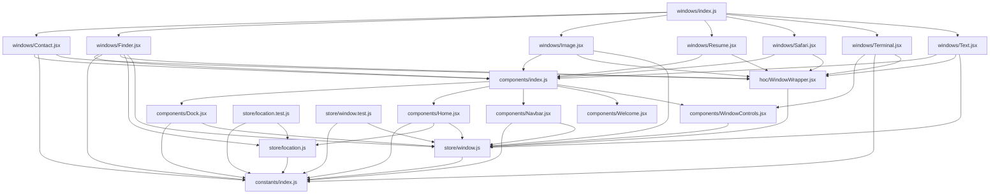

```mermaid
graph TD;
    components_Dock_jsx["components/Dock.jsx"] --> constants_index_js["constants/index.js"];
    components_Dock_jsx["components/Dock.jsx"] --> store_window_js["store/window.js"];
    components_Home_jsx["components/Home.jsx"] --> constants_index_js["constants/index.js"];
    components_Home_jsx["components/Home.jsx"] --> store_location_js["store/location.js"];
    components_Home_jsx["components/Home.jsx"] --> store_window_js["store/window.js"];
    components_Navbar_jsx["components/Navbar.jsx"] --> constants_index_js["constants/index.js"];
    components_Navbar_jsx["components/Navbar.jsx"] --> store_window_js["store/window.js"];
    components_WindowControls_jsx["components/WindowControls.jsx"] --> store_window_js["store/window.js"];
    components_index_js["components/index.js"] --> components_Dock_jsx["components/Dock.jsx"];
    components_index_js["components/index.js"] --> components_Home_jsx["components/Home.jsx"];
    components_index_js["components/index.js"] --> components_Navbar_jsx["components/Navbar.jsx"];
    components_index_js["components/index.js"] --> components_Welcome_jsx["components/Welcome.jsx"];
    components_index_js["components/index.js"] --> components_WindowControls_jsx["components/WindowControls.jsx"];
    hoc_WindowWrapper_jsx["hoc/WindowWrapper.jsx"] --> store_window_js["store/window.js"];
    store_location_js["store/location.js"] --> constants_index_js["constants/index.js"];
    store_location_test_js["store/location.test.js"] --> constants_index_js["constants/index.js"];
    store_location_test_js["store/location.test.js"] --> store_location_js["store/location.js"];
    store_window_js["store/window.js"] --> constants_index_js["constants/index.js"];
    store_window_test_js["store/window.test.js"] --> constants_index_js["constants/index.js"];
    store_window_test_js["store/window.test.js"] --> store_window_js["store/window.js"];
    windows_Contact_jsx["windows/Contact.jsx"] --> components_index_js["components/index.js"];
    windows_Contact_jsx["windows/Contact.jsx"] --> constants_index_js["constants/index.js"];
    windows_Contact_jsx["windows/Contact.jsx"] --> hoc_WindowWrapper_jsx["hoc/WindowWrapper.jsx"];
    windows_Finder_jsx["windows/Finder.jsx"] --> components_index_js["components/index.js"];
    windows_Finder_jsx["windows/Finder.jsx"] --> constants_index_js["constants/index.js"];
    windows_Finder_jsx["windows/Finder.jsx"] --> hoc_WindowWrapper_jsx["hoc/WindowWrapper.jsx"];
    windows_Finder_jsx["windows/Finder.jsx"] --> store_location_js["store/location.js"];
    windows_Finder_jsx["windows/Finder.jsx"] --> store_window_js["store/window.js"];
    windows_Image_jsx["windows/Image.jsx"] --> components_index_js["components/index.js"];
    windows_Image_jsx["windows/Image.jsx"] --> hoc_WindowWrapper_jsx["hoc/WindowWrapper.jsx"];
    windows_Image_jsx["windows/Image.jsx"] --> store_window_js["store/window.js"];
    windows_Resume_jsx["windows/Resume.jsx"] --> components_index_js["components/index.js"];
    windows_Resume_jsx["windows/Resume.jsx"] --> hoc_WindowWrapper_jsx["hoc/WindowWrapper.jsx"];
    windows_Safari_jsx["windows/Safari.jsx"] --> components_index_js["components/index.js"];
    windows_Safari_jsx["windows/Safari.jsx"] --> hoc_WindowWrapper_jsx["hoc/WindowWrapper.jsx"];
    windows_Terminal_jsx["windows/Terminal.jsx"] --> components_WindowControls_jsx["components/WindowControls.jsx"];
    windows_Terminal_jsx["windows/Terminal.jsx"] --> constants_index_js["constants/index.js"];
    windows_Terminal_jsx["windows/Terminal.jsx"] --> hoc_WindowWrapper_jsx["hoc/WindowWrapper.jsx"];
    windows_Text_jsx["windows/Text.jsx"] --> components_index_js["components/index.js"];
    windows_Text_jsx["windows/Text.jsx"] --> hoc_WindowWrapper_jsx["hoc/WindowWrapper.jsx"];
    windows_Text_jsx["windows/Text.jsx"] --> store_window_js["store/window.js"];
    windows_index_js["windows/index.js"] --> windows_Contact_jsx["windows/Contact.jsx"];
    windows_index_js["windows/index.js"] --> windows_Finder_jsx["windows/Finder.jsx"];
    windows_index_js["windows/index.js"] --> windows_Image_jsx["windows/Image.jsx"];
    windows_index_js["windows/index.js"] --> windows_Resume_jsx["windows/Resume.jsx"];
    windows_index_js["windows/index.js"] --> windows_Safari_jsx["windows/Safari.jsx"];
    windows_index_js["windows/index.js"] --> windows_Terminal_jsx["windows/Terminal.jsx"];
    windows_index_js["windows/index.js"] --> windows_Text_jsx["windows/Text.jsx"];
```
