# macos_portfolio


## Project Overview
No description provided.

## Technology Stack
- **Frontend**: React
- **Bundler**: Vite
- **Styling**: Tailwind CSS
- **State**: Zustand

## System Architecture

### Dependency Graph

```mermaid
graph TD;
    components_Dock_jsx["components/Dock.jsx"] --> constants_index_js["constants/index.js"];
    components_Dock_jsx["components/Dock.jsx"] --> store_window_js["store/window.js"];
    components_Home_jsx["components/Home.jsx"] --> constants_index_js["constants/index.js"];
    components_Home_jsx["components/Home.jsx"] --> store_location_js["store/location.js"];
    components_Home_jsx["components/Home.jsx"] --> store_window_js["store/window.js"];
    components_Navbar_jsx["components/Navbar.jsx"] --> constants_index_js["constants/index.js"];
    components_Navbar_jsx["components/Navbar.jsx"] --> store_window_js["store/window.js"];
    components_WindowControls_jsx["components/WindowControls.jsx"] --> store_window_js["store/window.js"];
    components_index_js["components/index.js"] --> components_Dock_jsx["components/Dock.jsx"];
    components_index_js["components/index.js"] --> components_Home_jsx["components/Home.jsx"];
    components_index_js["components/index.js"] --> components_Navbar_jsx["components/Navbar.jsx"];
    components_index_js["components/index.js"] --> components_Welcome_jsx["components/Welcome.jsx"];
    components_index_js["components/index.js"] --> components_WindowControls_jsx["components/WindowControls.jsx"];
    hoc_WindowWrapper_jsx["hoc/WindowWrapper.jsx"] --> store_window_js["store/window.js"];
    store_location_js["store/location.js"] --> constants_index_js["constants/index.js"];
    store_location_test_js["store/location.test.js"] --> constants_index_js["constants/index.js"];
    store_location_test_js["store/location.test.js"] --> store_location_js["store/location.js"];
    store_window_js["store/window.js"] --> constants_index_js["constants/index.js"];
    store_window_test_js["store/window.test.js"] --> constants_index_js["constants/index.js"];
    store_window_test_js["store/window.test.js"] --> store_window_js["store/window.js"];
    windows_Contact_jsx["windows/Contact.jsx"] --> components_index_js["components/index.js"];
    windows_Contact_jsx["windows/Contact.jsx"] --> constants_index_js["constants/index.js"];
    windows_Contact_jsx["windows/Contact.jsx"] --> hoc_WindowWrapper_jsx["hoc/WindowWrapper.jsx"];
    windows_Finder_jsx["windows/Finder.jsx"] --> components_index_js["components/index.js"];
    windows_Finder_jsx["windows/Finder.jsx"] --> constants_index_js["constants/index.js"];
    windows_Finder_jsx["windows/Finder.jsx"] --> hoc_WindowWrapper_jsx["hoc/WindowWrapper.jsx"];
    windows_Finder_jsx["windows/Finder.jsx"] --> store_location_js["store/location.js"];
    windows_Finder_jsx["windows/Finder.jsx"] --> store_window_js["store/window.js"];
    windows_Image_jsx["windows/Image.jsx"] --> components_index_js["components/index.js"];
    windows_Image_jsx["windows/Image.jsx"] --> hoc_WindowWrapper_jsx["hoc/WindowWrapper.jsx"];
    windows_Image_jsx["windows/Image.jsx"] --> store_window_js["store/window.js"];
    windows_Resume_jsx["windows/Resume.jsx"] --> components_index_js["components/index.js"];
    windows_Resume_jsx["windows/Resume.jsx"] --> hoc_WindowWrapper_jsx["hoc/WindowWrapper.jsx"];
    windows_Safari_jsx["windows/Safari.jsx"] --> components_index_js["components/index.js"];
    windows_Safari_jsx["windows/Safari.jsx"] --> hoc_WindowWrapper_jsx["hoc/WindowWrapper.jsx"];
    windows_Terminal_jsx["windows/Terminal.jsx"] --> components_WindowControls_jsx["components/WindowControls.jsx"];
    windows_Terminal_jsx["windows/Terminal.jsx"] --> constants_index_js["constants/index.js"];
    windows_Terminal_jsx["windows/Terminal.jsx"] --> hoc_WindowWrapper_jsx["hoc/WindowWrapper.jsx"];
    windows_Text_jsx["windows/Text.jsx"] --> components_index_js["components/index.js"];
    windows_Text_jsx["windows/Text.jsx"] --> hoc_WindowWrapper_jsx["hoc/WindowWrapper.jsx"];
    windows_Text_jsx["windows/Text.jsx"] --> store_window_js["store/window.js"];
    windows_index_js["windows/index.js"] --> windows_Contact_jsx["windows/Contact.jsx"];
    windows_index_js["windows/index.js"] --> windows_Finder_jsx["windows/Finder.jsx"];
    windows_index_js["windows/index.js"] --> windows_Image_jsx["windows/Image.jsx"];
    windows_index_js["windows/index.js"] --> windows_Resume_jsx["windows/Resume.jsx"];
    windows_index_js["windows/index.js"] --> windows_Safari_jsx["windows/Safari.jsx"];
    windows_index_js["windows/index.js"] --> windows_Terminal_jsx["windows/Terminal.jsx"];
    windows_index_js["windows/index.js"] --> windows_Text_jsx["windows/Text.jsx"];
```



*(Interactive SVG maps are available in `.github/diagrams/`)*

## Repository Structure
```json
{
  ".github": {
    "dependabot.yml": "file",
    "diagrams": {
      "architecture.mermaid.md": "file",
      "dependencies.json": "file",
      "dependencies.svg": "file"
    },
    "knowledge-graph": {
      "repo-data.json": "file"
    },
    "scripts": {
      "ai-agent.js": "file",
      "analyze.js": "file",
      "diagrams.js": "file",
      "docs.js": "file"
    },
    "workflows": {
      "ai-agent.yml": "file",
      "auto-docs.yml": "file",
      "ci-cd.yml": "file",
      "codeql.yml": "file"
    }
  },
  ".gitignore": "file",
  "CHANGELOG.md": "file",
  "CONTRIBUTING.md": "file",
  "README.md": "file",
  "REPOSITORY_HEALTH.md": "file",
  "audit_report.md": "file",
  "branch_audit.md": "file",
  "delete_safe_branches.ps1": "file",
  "eslint.config.js": "file",
  "index.html": "file",
  "jsconfig.json": "file",
  "keep_branches.txt": "file",
  "macos_portfolio@0.0.0": "file",
  "package-lock.json": "file",
  "package.json": "file",
  "pr_details.json": "file",
  "pr_report.md": "file",
  "public.zip": "file",
  "report.md": "file",
  "review_manually_branches.txt": "file",
  "safe_to_delete_branches.txt": "file",
  "src": {
    "App.jsx": "file",
    "assets": {
      "react.svg": "file"
    },
    "components": {
      "Dock.jsx": "file",
      "ErrorBoundary.jsx": "file",
      "Home.jsx": "file",
      "Navbar.jsx": "file",
      "Welcome.jsx": "file",
      "WindowControls.jsx": "file",
      "WindowControls.test.jsx": "file",
      "index.js": "file"
    },
    "constants": {
      "index.js": "file"
    },
    "hoc": {
      "WindowWrapper.jsx": "file"
    },
    "index.css": "file",
    "main.jsx": "file",
    "setupTests.js": "file",
    "store": {
      "location.js": "file",
      "location.test.js": "file",
      "window.js": "file",
      "window.test.js": "file"
    },
    "windows": {
      "Contact.jsx": "file",
      "Finder.jsx": "file",
      "Finder.test.jsx": "file",
      "Image.jsx": "file",
      "Resume.jsx": "file",
      "Safari.jsx": "file",
      "Terminal.jsx": "file",
      "Text.jsx": "file",
      "index.js": "file"
    }
  },
  "vite": "file",
  "vite.config.js": "file"
}
```

## Setup Instructions

1. Clone the repository
2. Run `npm install` (or `npm ci`)
3. Run `npm run dev` (or relevant script)

### Available Scripts
- `npm run dev`
- `npm run build`
- `npm run lint`
- `npm run preview`
- `npm run test`

## Deployment
Pushing to the `main` branch will automatically run tests, linting, and regenerate documentation.

## Contribution Guide
Ensure your code passes tests before opening a PR. The AI Agent will review PRs for architectural changes and suggest updates.

---
*This README is auto-generated and maintained by the repository's autonomous AI documentation system.*